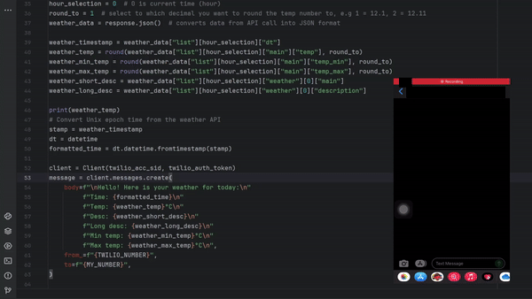

# weather-to-sms-python-app

## Description
weather-to-sms is a python app I created to text me 
the current weather and send the data to my phone via sms.

It tells me the weather in Celsius and gives text description.

This code can be hosted on a cloud platform and automatically 
send notifications like this at a specified time. 

However, there are prerequisites and code you need to modify
to make it work for you. 

## How to make it work? 

Of course, I do not want to disclose my phone number 
on GitHub, nor my API keys, so I fetched them from somewhere
else into my project. 

You will have to either place your keys
and phone number inside your .py file, or import them from a
different place, e.g. env variables. 

See below which services you need to sign up to 
and see below section to see which data to modify.

#### Note: You can use environment variables to hide the code when you upload it to cloud for deployments. 

## Installation
* Install required modules
* Sign up to OpenWeatherAPI to get your API key
* Sign up to Twilio SMS service to get your Twilio number, account sid and authorisation (auth) token
* https://www.pythonanywhere.com/ is a hosting and deployment platform (optional)
* Press "Play" button to run the app and get weather info

## Demo 

## Which variables you need to modify

Below is the list of variables you need to update to 
make the code work for you.

"twilio_acc_sid": "your_twilio_account_sid",

"twilio_auth_token": "your_twilio_auth_token",

"OWM_API_KEY": "Your_OpenWeatherAPI_Key",

"MY_NUMBER": "+12345",

"TWILIO_NUMBER": "+12345",

"LAT": "YOUR_LATITUDE_LOCATION",

"LON": "YOUR_LONGITUDE_LOCATION",

"UNITS": "metric" (optional: metric, imperial, etc)

